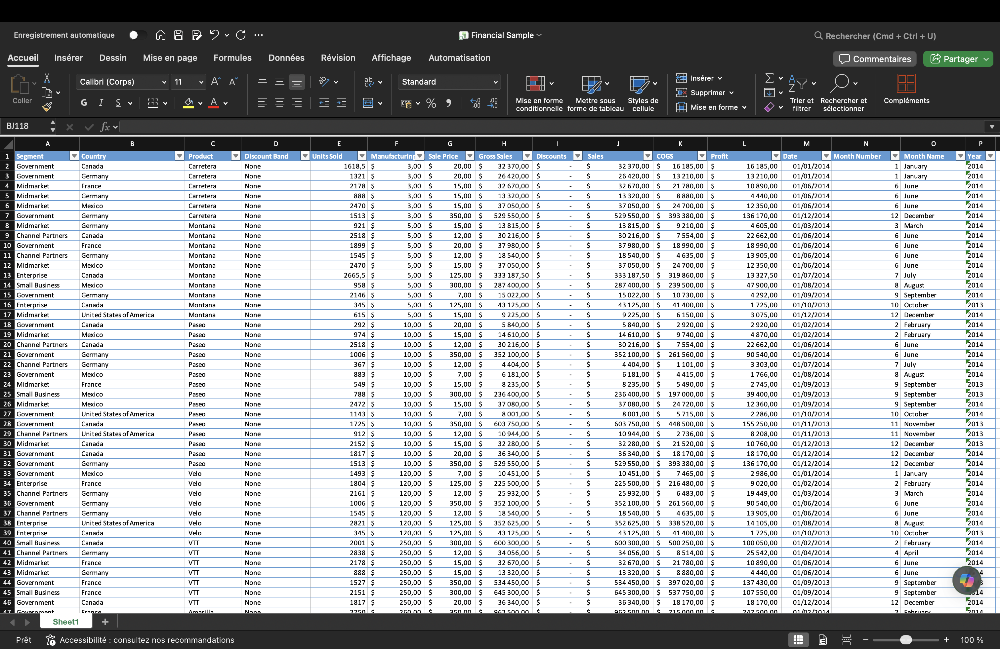
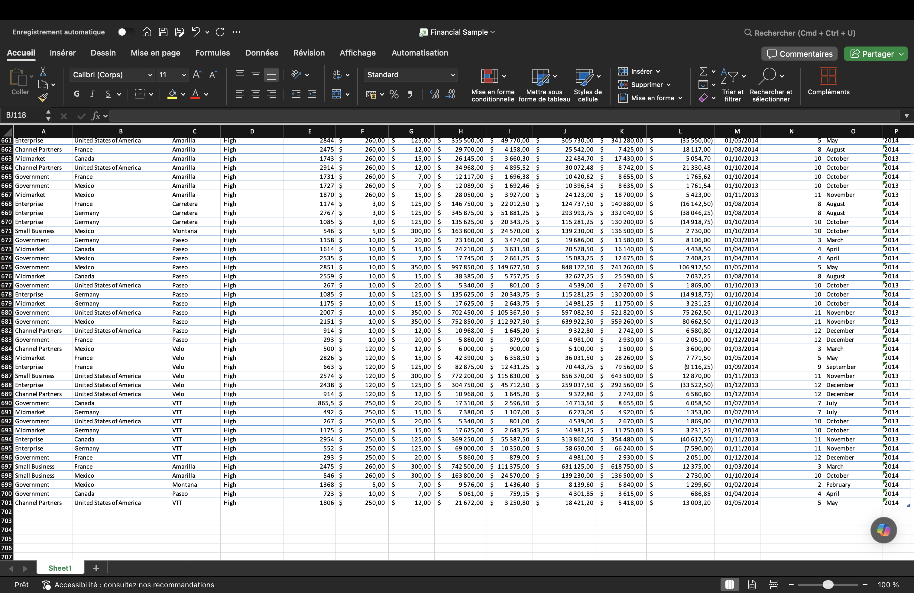

# 📈 Analyse de Performance Financière — Power BI

## 🎯 Présentation du Projet
Ce projet consiste en la création d'un **Tableau de Bord Décisionnel (Dashboard)** complet, interactif sous **Power BI Desktop**. L'objectif est de transformer un jeu de données financières brut et volumineux en un outil visuel d'aide à la décision, permettant d'évaluer la rentabilité d'une entreprise par pays, par produit et dans le temps.

---

## 📊 1. Données Brutes (Source Excel)
Le projet démarre à partir d'un fichier Microsoft Excel (`Financial Sample`) comprenant plus de 700 lignes de transactions commerciales internationales détaillant les segments, les coûts (COGS), les ventes et les profits.

<table>
  <tr>
    <td></td>
    <td></td>
  </tr>
</table>

---

## 🛠️ 2. Préparation et Nettoyage des Données (Power Query)
Avant de concevoir les visuels, une phase essentielle de **Data Preparation** a été menée dans l'éditeur **Power Query** pour garantir la qualité de la donnée :
*   **Uniformisation :** Remplacement des valeurs textuelles manquantes ou incorrectes (ex: remplacement de la valeur `"None"` par `"No Discount"` dans la colonne des remises).
*   **Nettoyage de texte :** Suppression des espaces superflus en début et fin de chaîne (*Trim*) pour éviter les erreurs de regroupement sur les segments et pays.
*   **Typage :** Vérification et correction du formatage de chaque colonne (Devises, Nombres décimaux, Textes).

<table>
  <tr>
    <td></td>
    <td></td>
  </tr>
</table>

---

## 🧮 3. Modélisation et Calculs Métiers (DAX)
Afin d'optimiser les performances du rapport et de ne pas surcharger le modèle, des mesures calculées personnalisées ont été développées en langage **DAX (Data Analysis Expressions)** :

* **Chiffre d'Affaires Global :**
    ```dax
    Total Sales = SUM(financials[Sales])
    ```

* **Bénéfice Net Global :**
    ```dax
    Total Profit = SUM(financials[Profit])
    ```

<table>
  <tr>
    <td></td>
    <td></td>
  </tr>
</table>

---

## 🏗️ 4. Évolution et Construction du Layout
Le déploiement des visuels s'est fait de manière incrémentale, en passant d'une première ébauche fonctionnelle à une architecture analytique complète :

*   **Premier jet (MVP) :** Intégration des premières cartes KPI et du graphique horizontal des pays. Identification des premiers axes d'amélioration (ajustement de la taille pour éliminer les barres de défilement masquant les pays, suppression des décimales superflues).
*   **Ajout des axes d'analyse :** Déploiement d'un histogramme vertical pour le suivi de la performance des **Produits** et d'un graphique en courbe (zone ombrée) pour analyser la saisonnalité des ventes par **Mois**.

<table>
  <tr>
    <td></td>
    <td></td>
  </tr>
</table>

---

## 🎨 5. Charte Graphique & Rendu Final (UI/UX)
L'interface a été entièrement retravaillée pour essayer adopter une identée visuelle épurée et moderne :
*   **Harmonie colorimétrique :** Utilisation d'un bleu marine profond pour les graphiques de structure et d'un bleu-gris pour créer une hiérarchie visuelle.
*   **Effet de relief (UI moderne) :** Ajout de bordures douces et d'ombres portées légères (*Shadows*) sous les cartes de KPI pour un effet de cartes flottantes.
*   **Épuration des axes :** Suppression des axes chiffrés redondants au profit d'**Étiquettes de données ** directes, simplifiant la lecture instantanée.

<table>
  <tr>
    <td></td>
    <td></td>
  </tr>
</table>

---

## ⚡ 6. Interactivité et Filtrage Croisé (Cross-Filtering)
Le point fort de ce rapport réside dans son interactivité totale. Le clic sur n'importe quel élément graphique reconfigure instantanément l'ensemble du tableau de bord pour isoler un scénario spécifique :

### 🔹 Zoom sur un Pays : United States of America
Lorsqu'on sélectionne la barre des **USA**, les cartes se mettent à jour dynamiquement pour indiquer **25,03 M€** de ventes et **3,00 M€** de profit. L'histogramme des produits met en surbrillance la part contributive de chaque produit (ex: **7 M€** pour le produit *Paseo*) par rapport au marché mondial global.
<p align="center">
  
</p>

### 🔹 Zoom sur un Produit : Paseo
En ciblant le produit star **Paseo**, on constate qu'il génère à lui seul **33,01 M€** de ventes pour **4,80 M€** de bénéfices. Le graphique des pays se modifie pour dévoiler la répartition géographique de ses ventes (menées à égalité par le Canada et le Mexique avec **8 M€** chacun).
<p align="center">
  
</p>

### 🔹 Zoom sur une Période : Décembre
En sélectionnant le point temporel de **Décembre** sur la courbe de tendance, le rapport isole les performances de fin d'année : **17,37 M€** de ventes mensuelles mondiales, portées majoritairement par le Canada (**6 M€**) et le produit *Paseo* (**5 M€**). Un marqueur visuel se positionne précisément sur la courbe chronologique.
<p align="center">
  
</p>

---

## 🧠 Compétences Démontrées
*   **Data Preparation & ETL :** Nettoyage et transformation de tables de données avec Power Query.
*   **Data Modeling & DAX :** Écriture de mesures de calculs optimisées.
*   **Data Visualization & UX :** Conception d'interfaces analytiques interactives et respect d'une charte graphique d'entreprise.

## 👤 Auteur
- **Clément Faure** - Mon LinkedIn : (https://www.linkedin.com/in/cl%C3%A9ment-faure-218713393/)
